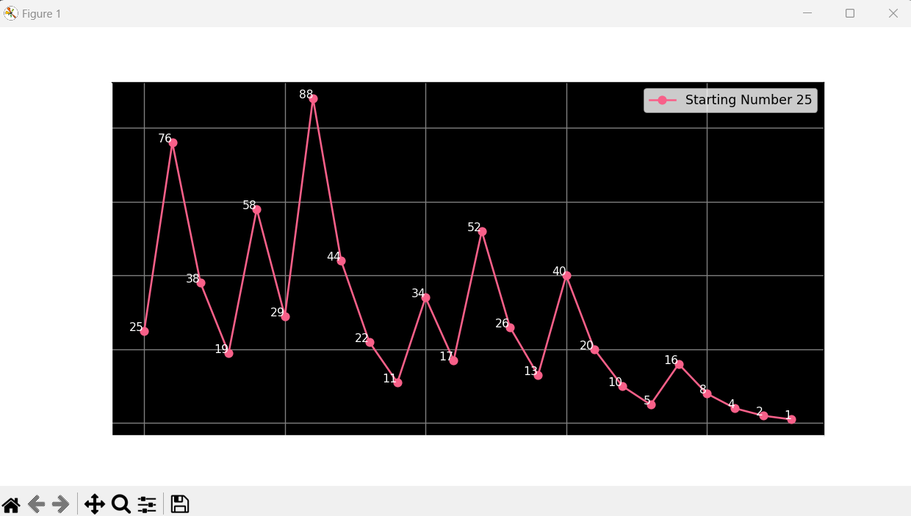

# The Collatz Conjecture Visualizer

<p align="center">

</p>

This Python program visualizes the **Collatz Conjecture** (also known as the 3x + 1 problem) through interactive graphs. For a given natural number, the program calculates the Collatz sequence and displays it graphically.

<p align="center">

</p>

## 📜 **What is the Collatz Conjecture?**
The Collatz Conjecture is a mathematical hypothesis proposed by Lothar Collatz in 1937. It states that for any positive integer `n`:
1. If `n` is even, divide it by 2.
2. If `n` is odd, multiply it by 3 and add 1.
Repeating these steps eventually leads to the number 1.

---

## 🚀 **Features**
- Interactive input for multiple starting numbers.
- Dynamic graphs for visualizing the Collatz sequences.
- Randomly generated unique colors for each sequence.
- Annotations for each point on the graph.

---

## 🛠️ **Setup**

### **Requirements**
The program requires the following Python libraries:
- `matplotlib`

### **Installation**
1. Clone this repository:
   ```bash
   git clone https://github.com/AaryanGole26/Collatz_Conjecture.git
   cd Collatz_Conjecture
   ```
2. Install the required library:
   ```bash
   pip install matplotlib
   ```
3. Run the program:
   ```bash
   python CollatzConjecture.py
   ```

---

## 🖼️ **Sample Output**
The program generates a graph similar to the image below. Each sequence is plotted with a unique color, showing the steps until the sequence reaches 1.



---

## 💡 **How It Works**
1. The user is prompted to enter natural numbers.
2. For each number, the Collatz sequence is calculated and plotted.
3. The graph is displayed with annotations for each step and value.

---

## 📂 **Files**
- `CollatzConjecture.py`: The main program script.

---

## 🧑‍💻 **Author**
- Aaryan Chandrakant Gole
